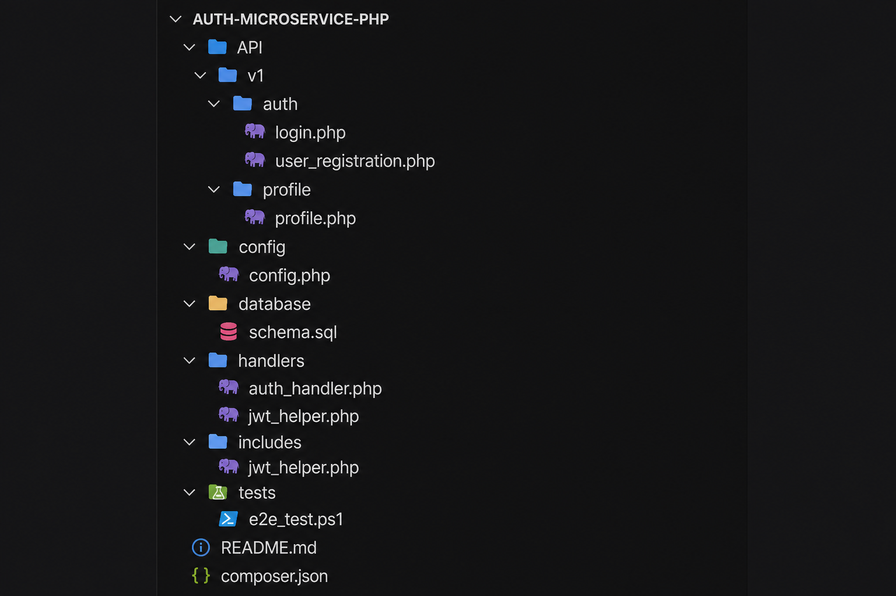

# PHP Authentication Microservice


A lightweight PHP authentication microservice with JWT access/refresh tokens, user registration, and profile management. Built for XAMPP/Apache deployments with a flat endpoint structure — no framework overhead.

This project demonstrates how to build a focused authentication microservice in plain PHP without Laravel or Symfony. It prioritizes secure JWT authentication, clear project organization, and reusable helper components you can drop into other services.

## Table of Contents

- [Design Principles](#design-principles)
- [Tech Stack](#tech-stack)
- [Architecture](#architecture)
- [Features](#features)
- [Quick Start](#quick-start)
- [API Overview](#api-overview)
- [Project Structure](#project-structure)
- [Testing](#testing)
- [Security Notes](#security-notes)

---

## Design Principles

- **Separation of concerns** — endpoints, handlers, helpers, and config live in distinct layers
- **Stateless REST API** — Bearer tokens, no server-side sessions
- **Reusable helper classes** — JWT, DB, validation, and response logic shared across endpoints
- **Prepared statements** — every query goes through EasyDB/PDO
- **Consistent JSON responses** — same envelope on every route

---

## Tech Stack

| Layer | Technology |
|-------|------------|
| Runtime | PHP 8.0+ |
| Database | MySQL / MariaDB via PDO |
| DB layer | [ParagonIE EasyDB](https://github.com/paragonie/easydb) |
| Auth | Custom JWT (HS256) |
| Dependencies | Composer |
| Server | Apache (`.htaccess` included) |

The service intentionally avoids full-stack frameworks to demonstrate secure authentication using plain PHP, reusable helper classes, and PDO-based data access.

## Architecture

Each endpoint is a standalone PHP file. Requests flow through shared helpers before hitting the database.

```
Client
  ↓
Endpoint        ←  API/v1/auth/*.php, API/v1/profile/*.php
  ↓
Validation      ←  Input rules, password policy
  ↓
Handler         ←  JwtHelper, auth_handler
  ↓
Database        ←  DbHandler (EasyDB, prepared statements)
  ↓
JSON Response   ←  STATUS / MESSAGE / DATA
```

**Auth flow:** Register → Login (access + refresh tokens) → Bearer token on protected routes → Refresh when access token expires.

---

## Features

What's actually in the codebase today:

| Feature | Status |
|---------|--------|
| JWT access & refresh tokens | ✅ Implemented |
| User registration & login | ✅ Implemented |
| Profile read & update | ✅ Implemented |
| Token validation & refresh | ✅ Implemented |
| UUID primary keys | ✅ Implemented |
| Password policy validation | ✅ Implemented |
| Prepared statements (SQL injection protection) | ✅ Implemented |
| CORS headers | ✅ Implemented (`.htaccess`) |
| GZIP compression | ✅ Implemented (`.htaccess`) |
| Structured JSON responses | ✅ Implemented |
| Error logging | ✅ Implemented |
| Forgot password | ⚠️ Stub — generates token, no email/DB persistence yet |
| Rate limiting | ⚠️ Config placeholder in `config/config.php`, not enforced |
| CSRF tokens | ⚠️ Config placeholder — not needed for stateless Bearer-token API |

---

## Quick Start

### 1. Clone & install

```bash
git clone https://github.com/MUKHTIARSHAH/Auth-Microservice-PHP.git
cd Auth-Microservice-PHP
composer install
```

### 2. Database

Import the schema:

```bash
mysql -u root -p < database/schema.sql
```

This creates the `first_api` database and the `info` user table with UUID primary keys. See [`database/schema.sql`](database/schema.sql) for the full DDL.

### 3. Configuration

Set your database credentials and JWT secret in `config/config.php`. You can also set `JWT_SECRET` via environment variable. Password policy, rate-limit defaults, and log paths are configured in the same file.

### 4. Run locally

Place the project in your web root (e.g. `htdocs/Auth-Microservice-PHP`) and send a request:

```http
POST /API/v1/auth/login.php
Content-Type: application/json
```

```json
{
  "username": "johndoe",
  "password": "SecurePassword123!"
}
```

Full URL example: `http://localhost/Auth-Microservice-PHP/API/v1/auth/login.php` — adjust to match your folder name.

---

## API Overview

| Method | Endpoint | Auth | Description |
|--------|----------|------|-------------|
| `POST` | `/API/v1/profile/user_registration.php` | — | Register a new user |
| `POST` | `/API/v1/auth/login.php` | — | Authenticate, receive tokens |
| `GET` | `/API/v1/auth/token_validation.php` | Bearer | Validate access token |
| `POST` | `/API/v1/auth/refresh-token.php` | — | Exchange refresh token |
| `POST` | `/API/v1/auth/logout.php` | Bearer | Logout |
| `POST` | `/API/v1/auth/forgot-password.php` | — | Request password reset (stub) |
| `GET` | `/API/v1/profile/profile.php` | Bearer | Get user profile |
| `POST` | `/API/v1/profile/update.php` | Bearer | Update user profile |

Full request/response examples are in [`postman_examples.txt`](postman_examples.txt).

### Response format

All endpoints return the same envelope:

```json
{
  "STATUS": "success",
  "MESSAGE": "Login successful",
  "DATA": {},
  "CODE": 200,
  "TIMESTAMP": "2024-01-01 12:00:00"
}
```

Errors use `"STATUS": "error"`. Validation failures include field-level details in `DATA`.

### Login response example

A successful `POST /API/v1/auth/login.php` returns:

```json
{
  "STATUS": "success",
  "MESSAGE": "Login successful. User authenticated and token generated.",
  "DATA": {
    "id": "a1b2c3d4-e5f6-7890-abcd-ef1234567890",
    "username": "johndoe",
    "email_address": "john@example.com",
    "full_name": "John Doe",
    "roles": ["user"],
    "app_id": "first_api",
    "access_token": "eyJhbGciOiJIUzI1NiIs...",
    "refresh_token": "eyJhbGciOiJIUzI1NiIs...",
    "token_type": "Bearer",
    "expires_in": 3600
  },
  "CODE": 200,
  "TIMESTAMP": "2024-01-01 12:00:00"
}
```

Use `access_token` in the `Authorization: Bearer` header for protected routes.

---

## Project Structure



*Folder layout in VS Code. Add a Postman login screenshot here when you have one — it helps reviewers see the API working.*

```
Auth-Microservice-PHP/
├── API/v1/
│   ├── auth/              # login, logout, refresh, token validation, forgot-password
│   └── profile/           # registration, profile, update
├── config/
│   └── config.php         # database, JWT, security settings
├── database/
│   └── schema.sql         # MySQL schema (UUID primary keys)
├── handlers/
│   └── auth_handler.php   # JWT authentication middleware
├── includes/              # JWT, DB, validation, logging helpers
├── tests/
│   └── e2e_test.ps1       # PowerShell smoke tests
├── postman_examples.txt   # Postman-ready examples
└── composer.json
```

---

## Testing

**Postman** — import examples from `postman_examples.txt`.

**E2E script** — update the base URL in `tests/e2e_test.ps1` to match your local path, then:

```powershell
cd tests
.\e2e_test.ps1
```

Suggested manual flow: register → login → validate token → fetch profile → update profile → refresh token → logout.

---

## Security Notes

- Passwords are hashed with `password_hash()` / verified with `password_verify()`.
- All DB queries use prepared statements via EasyDB.
- Users are identified by UUIDs, not auto-increment integers.
- Set a strong `JWT_SECRET` before any deployment.
- The forgot-password endpoint is a development stub — do not use as-is in production.
- Rate limiting is configured but not yet enforced in middleware.

For production: enable HTTPS, rotate JWT secrets, wire up real email for password reset, and implement rate limiting.

---

© 2026 Mukhtiar Shah. All rights reserved.
